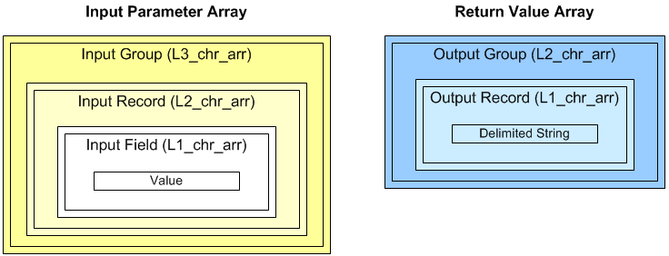
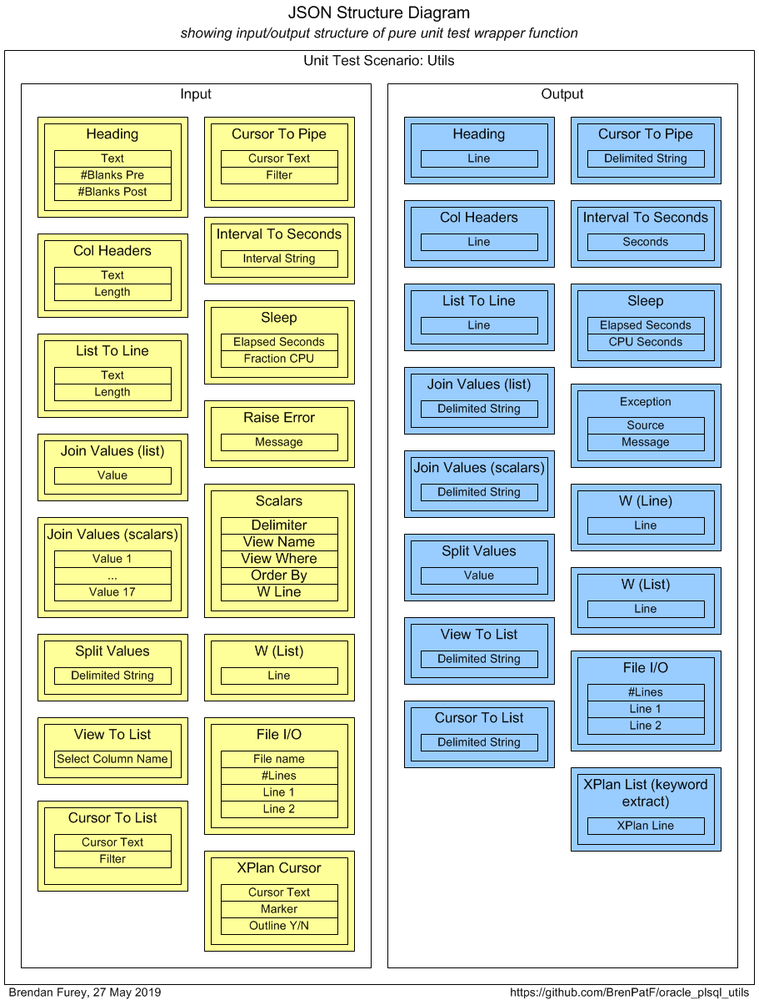
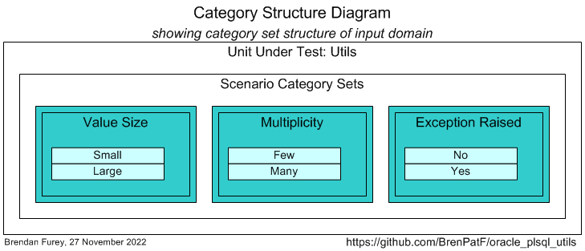
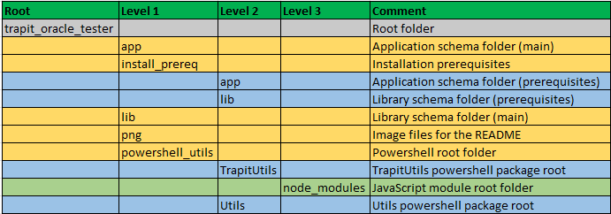

# Trapit - Oracle PL/SQL Unit Testing Module


> The Math Function Unit Testing design pattern, implemented in Oracle PL/SQL

:detective:

This module supports [The Math Function Unit Testing Design Pattern](https://brenpatf.github.io/2023/06/05/the-math-function-unit-testing-design-pattern.html), a new design pattern that can be applied in any language, and is here implemented in Oracle PL/SQL. The module name is derived from 'TRansactional API Testing' (TRAPIT), and the 'unit' should be considered to be a transactional unit. The pattern avoids microtesting, is data-driven, and fully supports multi-scenario testing and refactoring.

The Oracle PL/SQL Trapit module provides a lightweight framework for unit testing SQL and PL/SQL, with test data read from an input JSON file, results written to an output JSON file, and all specific test code contained in a PL/SQL function called by the framework driver function.

Unit test results are formatted by a JavaScript program that takes the JSON output results file as its input, [Trapit - JavaScript Unit Testing/Formatting Utilities Module](https://github.com/BrenPatF/trapit_nodejs_tester), and renders the results in HTML and text formats.

There is also a PowerShell module, [Trapit - PowerShell Unit Testing Utilities Module](https://github.com/BrenPatF/powershell_utils/tree/master/TrapitUtils), with a utility to generate a template for the JSON input file used by the design pattern, based on simple input CSV files. The module also provides a utility to automate running of the Oracle PL/SQL tests and formatting of the results by the JavaScript program.

This blog post, [Unit Testing, Scenarios and Categories: The SCAN Method](https://brenpatf.github.io/2021/10/17/unit-testing-scenarios-and-categories-the-scan-method.html) provides guidance on effective selection of scenarios for unit testing.

There is an extended Usage section below that illustrates the use of the design pattern for Oracle PL/SQL unit testing by means of an example from another GitHub project.

# In this README...
[&darr; Background](#background)<br />
[&darr; Usage](#usage)<br />
[&darr; API](#api)<br />
[&darr; Installation](#installation)<br />
[&darr; Unit Testing](#unit-testing)<br />
[&darr; Folder Structure](#folder-structure)<br />
[&darr; See Also](#see-also)<br />
## Background
[&uarr; In this README...](#in-this-readme)<br />

I explained the concepts for the unit testing design pattern in relation specifically to database testing in a presentation at the Oracle User Group Ireland Conference in March 2018:

- [The Database API Viewed As A Mathematical Function: Insights into Testing](https://www.slideshare.net/brendanfurey7/database-api-viewed-as-a-mathematical-function-insights-into-testing)

I later named the approach [The Math Function Unit Testing Design Pattern](https://brenpatf.github.io/2023/06/05/the-math-function-unit-testing-design-pattern.html) when I applied it in Javascript and wrote a JavaScript program to format results both in plain text and as HTML pages:
- [Trapit - JavaScript Unit Testing/Formatting Utilities Module](https://github.com/BrenPatF/trapit_nodejs_tester)

The module also allowed for the formatting of results obtained from testing in languages other than JavaScript by means of an intermediate output JSON file. In 2021 I developed a PowerShell module that included a utility to generate a template for the JSON input scenarios file required by the design pattern:
- [Trapit - PowerShell Unit Testing Utilities Module](https://github.com/BrenPatF/powershell_utils/tree/master/TrapitUtils)

Also in 2021 I developed a systematic approach to the selection of unit test scenarios:
- [Unit Testing, Scenarios and Categories: The SCAN Method](https://brenpatf.github.io/2021/10/17/unit-testing-scenarios-and-categories-the-scan-method.html)

In early 2023 I extended both the JavaScript results formatter, and the PowerShell utility to incorporate Category Set as a scenario attribute. Both utilities support use of the design pattern in any language, while the unit testing driver utility is language-specific and is currently available in PowerShell, JavaScript, Python and Oracle PL/SQL versions.

This module is a prerequisite for the unit testing parts of these other Oracle GitHub modules:
- [Utils - Oracle PL/SQL General Utilities Module](https://github.com/BrenPatF/oracle_plsql_utils)
- [Log_Set - Oracle PL/SQL Logging Module](https://github.com/BrenPatF/log_set_oracle)
- [Timer_Set - Oracle PL/SQL Code Timing Module](https://github.com/BrenPatF/timer_set_oracle)
- [Net_Pipe - Oracle PL/SQL Network Analysis Module](https://github.com/BrenPatF/plsql_network)
- [Shortest Path Analysis of Large Networks by SQL and PL/SQL](https://github.com/BrenPatF/shortest_path_sql)
- [Optimization Problems with Items and Categories in Oracle](https://github.com/BrenPatF/item_category_optimization_oracle)
- [Coupons, Caps and Functions in Oracle](https://github.com/BrenPatF/coupon_caps_oracle)
## Usage
[&uarr; In this README...](#in-this-readme)<br />
[&darr; General Usage](#general-usage)<br />
[&darr; Example - Oracle PL/SQL Utilities](#example---oracle-plsql-utilities)<br />

As noted above, the JavaScript module allows for unit testing of JavaScript programs and also the formatting of test results for both JavaScript and non-JavaScript programs. Similarly, the PowerShell module mentioned allows for unit testing of PowerShell programs, and also the generation of the JSON input scenarios file template for testing in any language.

In this section we'll start by describing the steps involved in [The Math Function Unit Testing Design Pattern](https://brenpatf.github.io/2023/06/05/the-math-function-unit-testing-design-pattern.html) at an overview level. This will show how the generic PowerShell and JavaScript utilities fit in alongside the language-specific driver utilities.

Then we'll show how to use the design pattern in unit testing Oracle programs, first in general, and then by means of an example from another GitHub project.

### General Usage
[&uarr; Usage](#usage)<br />
[&darr; General Description](#general-description)<br />
[&darr; Unit Testing Process](#unit-testing-process)<br />
[&darr; Unit Test Results](#unit-test-results)<br />

At a high level [The Math Function Unit Testing Design Pattern](https://brenpatf.github.io/2023/06/05/the-math-function-unit-testing-design-pattern.html) involves three main steps:

1. Create an input file containing all test scenarios with input data and expected output data for each scenario
2. Create a results object based on the input file, but with actual outputs merged in, based on calls to the unit under test
3. Use the results object to generate unit test results files formatted in HTML and/or text


#### General Description
[&uarr; General Usage](#general-usage)<br />

The first and third of the three steps are supported by generic utilities that can be used in unit testing in any language. The second step uses a language-specific unit test driver utility.

For non-JavaScript programs the results object is materialized using a library package in the relevant language. The diagram below shows how the processing from the input JSON file splits into two distinct steps:
- First, the output results object is created using the external library package which is then written to a JSON file
- Second, a script from the Trapit JavaScript library package is run, passing in the name of the output results JSON file

This creates a subfolder with name based on the unit test title within the file, and also outputs a summary of the results. The processing for step 1 is split between four code units:
- Test Driver: This drives the unit testing, calling Test Unit, and may be written in a scripting language, such as PowerShell for example
- Purely Wrap API: The wrapper function that is passed the inputs and returns the actual outputs for a single scenario
- Unit Under Test (API): Called by the wrapper function, which converts between its specific inputs and outputs and the generic version used by the library package
- Test Unit: External library function that drives the unit testing with a call to a specific wrapper function via dynamic SQL


In the first step the external program creates the output results JSON file, while in the second step the file is read into an object by the Trapit library package, which then formats the results.

#### Unit Testing Process
[&uarr; General Usage](#general-usage)<br />
[&darr; Step 1: Create Input Scenarios File](#step-1-create-input-scenarios-file)<br />
[&darr; Step 2: Create Results Object](#step-2-create-results-object)<br />
[&darr; Step 3: Format Results](#step-3-format-results)<br />

This section details the three steps involved in following [The Math Function Unit Testing Design Pattern](https://brenpatf.github.io/2023/06/05/the-math-function-unit-testing-design-pattern.html).

##### Step 1: Create Input Scenarios File
[&uarr; Unit Testing Process](#unit-testing-process)<br />
[&darr; Unit Test Wrapper Function](#unit-test-wrapper-function)<br />
[&darr; Scenario Category ANalysis (SCAN)](#scenario-category-analysis-scan)<br />
[&darr; Creating and Loading the Input Scenarios File](#creating-and-loading-the-input-scenarios-file)<br />

Step 1 requires analysis to determine the extended signature for the unit under test, and to determine appropriate scenarios to test.

It may be useful during the analysis phase to create two diagrams, one for the extended signature:
- JSON Structure Diagram: showing the groups with their fields for input and output

and another for the scenario category sets and categories:
- Category Structure Diagram: showing the category sets identified with their categories

You can see examples of these diagrams later in this document: [JSON Structure Diagram](#unit-test-wrapper-function-1) and [Category Structure Diagram](#scenario-category-analysis-scan-1), and schematic versions in the next two subsections.

###### Unit Test Wrapper Function
[&uarr; Step 1: Create Input Scenarios File](#step-1-create-input-scenarios-file)<br />

Here is a schematic version of a JSON structure diagram, which in a real instance will  in general have multiple input and output groups, each with multiple fields:


Each group in the diagram corresponds to a top-level element within the p_inp_3lis 3-level array parameter or L2_chr_arr 2-level array return value of the wrapper function. The fields are stored as 3rd-level array elements in the input parameter, and as elements in delimited strings in the return value 2-level array.

```sql
FUNCTION Purely_Wrap_Utils(
            p_inp_3lis                     L3_chr_arr)   -- input list of lists (group, record, field)
            RETURN                         L2_chr_arr IS -- output list of lists (group, record)
```

###### Scenario Category ANalysis (SCAN)
[&uarr; Step 1: Create Input Scenarios File](#step-1-create-input-scenarios-file)<br />

The art of unit testing lies in choosing a set of scenarios that will produce a high degree of confidence in the functioning of the unit under test across the often very large range of possible inputs.

A useful approach can be to think in terms of categories of inputs, where we reduce large ranges to representative categories, an idea I explore in this article:

- [Unit Testing, Scenarios and Categories: The SCAN Method](https://brenpatf.github.io/2021/10/17/unit-testing-scenarios-and-categories-the-scan-method.html)

Here is a schematic version of a category set diagram, which in a real instance will  in general have multiple category sets, each with multiple categories:


Each category i-j in the diagram corresponds to a scenario j for category set i.

###### Creating and Loading the Input Scenarios File
[&uarr; Step 1: Create Input Scenarios File](#step-1-create-input-scenarios-file)<br />

The results of the analysis can be summarised in three CSV files which a PowerShell program uses as inputs to create a template for the JSON file.

The PowerShell API, `Write-UT_Template` creates a template for the JSON file, with the full meta section, and a set of template scenarios having name as scenario key, a category set attribute, and zero or more records with default values for each input and output group. The API takes as inputs three CSV files:
  - `stem`\_inp.csv: list of group, field, values tuples for input
  - `stem`\_out.csv: list of group, field, values tuples for output
  - `stem`\_sce.csv: scenario triplets - (Category set, scenario name, active flag); this file is optional

In the case where a scenarios file is present, each group has zero or more records with field values taken from the group CSV files, with a record for each value column present where at least one value is not null for the group. The template scenario represents a kind of prototype scenario, where records may be manually updated (and added or subtracted) to reflect input and expected output values for the actual scenario being tested.

The API can be run with the following PowerShell in the folder of the CSV files:

###### Format-JSON-Stem.ps1
```powershell
Import-Module TrapitUtils
Write-UT_Template 'stem' '|' 'title'
```
This creates the template JSON file, `stem`\_temp.json based on the CSV files having prefix `stem` and using the field delimiter '|', and including the unit test title passed. The PowerShell API can be used for testing in any language.

The template file is then updated manually with data appropriate to each scenario.

###### Load JSON File into Database

A record is added into the table TT_UNITS by a call to the Trapit.Add_Ttu API as shown. The input JSON file must first be placed in the operating system folder pointed to by the INPUT_DIR directory, and is loaded into a JSON column in the table. The name of the unit test package ('TT_PKG'), the function ('Purely_Wrap_Uut'), and the unit test group ('lib') are also passed.
```sql
BEGIN
  Trapit.Add_Ttu('TT_PKG', 'Purely_Wrap_Uut', 'lib', 'Y', 'tt_pkg.purely_wrap_uut_inp.json');
END;
/
```

##### Step 2: Create Results Object
[&uarr; Unit Testing Process](#unit-testing-process)<br />
[&darr; Trapit_Run Package](#trapit_run-package)<br />
[&darr; TT_Package.Purely_Wrap_Uut](#tt_packagepurely_wrap_uut)<br />

Step 2 requires the writing of a wrapper function that is called by a library packaged subprogram that runs all tests for a group name passed in as a parameter.

The library subprogram calls the wrapper function, specific to the unit under test, within a loop over the scenarios in the input JSON file. The names of the JSON file and of the wrapper function are assigned as part of the installation of the unit test data. The function specification is fixed, as shown in the extract below, while the function body is specific to the unit under test.

The library subprogram writes the output JSON file with the actual results, obtained from the wrapper function, merged in along with the expected results.

In non-database languages, such as JavaScript or Python, the wrapper function can be defined in a script and passed as a parameter in a call to the library subprogram. In Oracle PL/SQL the wrapper function is defined in the database and called using dynamic PL/SQL from the library subprogram.

###### Trapit_Run Package
[&uarr; Step 2: Create Results Object](#step-2-create-results-object)<br />

The test data are read from a table TT_UNITS, with structure:

| Column                      | Type                  | Notes                                                                   |
|:----------------------------|:----------------------|:------------------------------------------------------------------------|
| unit_test_package_nm        | VARCHAR2(30) NOT NULL | Name of the package holding the wrapper function                        |
| purely_wrap_api_function_nm | VARCHAR2(30) NOT NULL | Name of the wrapper function                                            |
| group_nm                    | VARCHAR2(30)          | Unit test group name                                                    |
| description                 | VARCHAR2(500)         | Description of unit test                                                |
| title                       | VARCHAR2(100)         | Optional title of unit test, overrides JSON file attribute if set       |
| active_yn                   | VARCHAR2(1)           | Active flag, test not executed if set to N                              |
| input_json                  | CLOB                  | Input JSON text, read from database server file in an installation step |
| output_json                 | CLOB                  | Output JSON text, written on completion of a test run                   |


Unit tests are run by making a call to one of two library subprograms that run all tests for a group name passed in as a parameter.

```sql
PROCEDURE Run_Tests(p_group_nm VARCHAR2);
```
The above procedure runs the tests for the input group leaving the output JSON files in the assigned directory on the database server.

This version was originally used to execute step 3 separately from step 2.

```sql
FUNCTION Test_Output_Files(p_group_nm VARCHAR2) RETURN L1_chr_arr;
```
The above function runs the tests for the input group leaving the output JSON files in the assigned directory on the database server, and returns the full file paths in an array.

This version is used by a PowerShell script that combines steps 2 and 3, as shown in step 3 below.

###### TT_Package.Purely_Wrap_Uut
[&uarr; Step 2: Create Results Object](#step-2-create-results-object)<br />

Here is the specification for the wrapper function (fixed apart from the function name), with the header comment text.
```sql
/***************************************************************************************************
Purely_Wrap_Uut: Unit test wrapper function for the unit under test

    Returns the 'actual' outputs, given the inputs for a scenario, with the signature expected for
    the Math Function Unit Testing design pattern, namely:

      Input parameter: 3-level list (type L3_chr_arr) with test inputs as group/record/field
      Return Value: 2-level list (type L2_chr_arr) with test outputs as group/record (with record as
                   delimited fields string)

***************************************************************************************************/
FUNCTION Purely_Wrap_Uut(
            p_inp_3lis                     L3_chr_arr) -- input list of lists (group, record, field)
            RETURN                         L2_chr_arr; -- output list of lists (group, record)
```
The input parameter and return value are of nested array types, and it is convenient for programming reasons to split the input records into fields, but return record values as delimited strings.



This wrapper function may need to write inputs to, and read outputs from, tables, but should be 'externally pure' in the sense that any changes made are rolled back before returning, including any made by the unit under test.

##### Step 3: Format Results
[&uarr; Unit Testing Process](#unit-testing-process)<br />

Step 3 involves formatting the results contained in the JSON output file from step 2, via the JavaScript formatter, and this step can be combined with step 2 for convenience. PowerShell is used to automate the steps.

- `Test-FormatDB` is the function from the TrapitUtils PowerShell package that calls the main test driver function, then passes the output JSON file name to the JavaScript formatter and outputs a summary of the results. It takes as parameters:

    - `[String]unpw`        - Oracle user name / password string
    - `[String]conn`        - Oracle connection string (such as the TNS alias)
    - `[String]utGroup`     - Oracle unit test group
    - `[String]testRoot`    - unit testing root folder, where results folders will be placed
    - `[String]preSQL`      - optional PL/SQL block to execute first

    with return value:

    - `[String]`: summary of results, repeated for each unit test in group

##### Test-Format-Lib.ps1
The test driver script passes the database credentials and the unit test group name into the entry point PowerShell TrapitUtils library API.

```powershell
Import-Module ..\powershell_utils\TrapitUtils\TrapitUtils
Test-FormatDB 'lib/lib' 'orclpdb' 'lib' $PSScriptRoot
```

#### Unit Test Results
[&uarr; General Usage](#general-usage)<br />
[&darr; Unit Test Report - Scenario List](#unit-test-report---scenario-list)<br />
[&darr; Unit Test Report - Scenario Pages](#unit-test-report---scenario-pages)<br />

The script above creates a results subfolder for each unit in the 'lib' group, with results in text and HTML formats, in the script folder, and outputs a text summary of the following form (repeated for each unit in the group):

```
Results summary for file: [MY_PATH]/stem_out.json
=================================================

File:          stem_out.json
Title:         [Title]
Inp Groups:    [#Inp Groups]
Out Groups:    [#Out Groups]
Tests:         [#Tests]
Fails:         [#Fails]
Folder:        [Folder]
```

Within the results subfolder there is a text file containing a list of summary results at scenario level, followed by the detailed results for each scenario. In addition there are files providing the results in HTML format.

##### Unit Test Report - Scenario List
[&uarr; Unit Test Results](#unit-test-results)<br />

The scenario list page lists, for each scenario:

- \# - the scenario index
- Category Set - the category set applying to the scenario
- Scenario - a description of the scenario
- Fails (of N) - the number of groups failing, with N being the total number of groups
- Status - SUCCESS or FAIL

The scenario field is a hyperlink to the individual scenario page.

##### Unit Test Report - Scenario Pages
[&uarr; Unit Test Results](#unit-test-results)<br />

The page for each scenario has the following schematic structure:
```
SCENARIO i: Scenario [Category Set: (category set)]
  INPUTS
    For each input group: [Group name] - a heading line followed by a list of records
      For each field: Field name
      For each record: 1 line per record, with record number followed by:
        For each field: Field value for record
  OUTPUTS
    For each output group: [Group name] - a heading line followed by a list of records
      For each field: Field name
      For each record: 1 line per record, with record number followed by:
        For each field: Field expected value for record
        For each field: Field actual value for record (only if any actual differs from expected)
    Group status - #fails of #records: SUCCESS / FAIL
Scenario status - #fails of #groups: SUCCESS / FAIL
```
### Example - Oracle PL/SQL Utilities
[&uarr; Usage](#usage)<br />
[&darr; Example Description](#example-description)<br />
[&darr; Unit Testing Process](#unit-testing-process-1)<br />
[&darr; Unit Test Results](#unit-test-results-1)<br />

#### Example Description
[&uarr; Example - Oracle PL/SQL Utilities](#example---oracle-plsql-utilities)<br />

The example comes from [Utils - Oracle PL/SQL general utilities module](https://github.com/BrenPatF/oracle_plsql_utils), a module comprising a set of generic user-defined Oracle types and a PL/SQL package of functions and procedures of general utility.

#### Unit Testing Process
[&uarr; Example - Oracle PL/SQL Utilities](#example---oracle-plsql-utilities)<br />
[&darr; Step 1: Create Input Scenarios File](#step-1-create-input-scenarios-file-1)<br />
[&darr; Step 2: Create Results Object](#step-2-create-results-object-1)<br />
[&darr; Step 3: Format Results](#step-3-format-results-1)<br />

In this section we show extracts from the README for the above project for each of the three unit test steps.

##### Step 1: Create Input Scenarios File
[&uarr; Unit Testing Process](#unit-testing-process-1)<br />
[&darr; Unit Test Wrapper Function](#unit-test-wrapper-function-1)<br />
[&darr; Scenario Category ANalysis (SCAN)](#scenario-category-analysis-scan-1)<br />
[&darr; Creating and Loading the Input Scenarios File](#creating-and-loading-the-input-scenarios-file-1)<br />

Step 1 requires analysis to determine the extended signature for the unit under test, and to determine appropriate scenarios to test.  The results of this analysis can be summarised in three CSV files which a PowerShell API, `Write-UT_Template`, uses as inputs to create a template for the JSON file.

###### Unit Test Wrapper Function
[&uarr; Step 1: Create Input Scenarios File](#step-1-create-input-scenarios-file-1)<br />

Here is a diagram of the input and output groups for this example:



From the input and output groups depicted we can construct CSV files with flattened group/field structures, and default values added, as follows (with `tt_utils.purely_wrap_utils_inp.csv` left, `tt_utils.purely_wrap_utils_out.csv` right):


A PowerShell utility uses these CSV files, together with one for scenarios, discussed next, to generate a template for the JSON unit testing input file. The utility creates a prototype scenario dataset with a record in each group for each populated value column (in this case there's only one), that is used for each scenario in the template.

###### Scenario Category ANalysis (SCAN)
[&uarr; Step 1: Create Input Scenarios File](#step-1-create-input-scenarios-file-1)<br />

As explained in the [article](https://brenpatf.github.io/2021/10/17/unit-testing-scenarios-and-categories-the-scan-method.html) mentioned above, it can be very useful to think in terms of generic category sets that apply in many situations. In this case, where we are testing a set of independent utilities, they are particularly useful and can be applied across many of the utilities at the same time.

After analysis of the possible scenarios in terms of categories and category sets, we can depict them on a Category Structure diagram:



In this case, we can apply the generic category sets identified to the set of mostly independent utility programs. We can tabulate the results of the category analysis, and assign a scenario against each category set/category with a unique description:

|  # | Category Set     | Category | Scenario             |
|---:|:-----------------|:---------|:---------------------|
|  1 | Value Size       | Small    | Small values         |
|  2 | Value Size       | Large    | Large values         |
|  3 | Multiplicity     | One      | One value            |
|  4 | Multiplicity     | Many     | Many values          |
|  5 | Exception Raised | Yes      | SQL exception raised |

In this case we are not creating a specific scenario for the 'Exception Raised / No' category, since this is covered by all of the first four scenarios.

From the scenarios identified we can construct the following CSV file (`tt_utils.purely_wrap_utils_sce.csv`), taking the category set and scenario columns, and adding an initial value for the active flag:


###### Creating and Loading the Input Scenarios File
[&uarr; Step 1: Create Input Scenarios File](#step-1-create-input-scenarios-file-1)<br />

The results of the analysis can be summarised in three CSV files which a PowerShell API, `Write-UT_Template`, uses as inputs to create a template for the JSON file.

This template file, tt_utils.purely_wrap_utils_temp.json, contains the full meta section (which describes groups and fields), and a set of template scenarios having name as scenario key, a category set attribute, and a single record with default values for each input and output group.

###### Format-JSON-Utils.ps1
```powershell
Import-Module ..\powershell_utils\TrapitUtils\TrapitUtils
Write-UT_Template 'tt_utils.purely_wrap_utils' ';'
```
This creates the template JSON file, tt_utils.purely_wrap_utils_temp.json based on the CSV files having prefix `tt_utils.purely_wrap_utils` and using the field delimiter ';'. The PowerShell API can be used for testing in any language.

The template file is then updated manually with data appropriate to each scenario.

###### Load JSON File into Database

A record is added into the table TT_UNITS by a call to the Trapit.Add_Ttu API as shown. The input JSON file must first be placed in the operating system folder pointed to by the INPUT_DIR directory, and is loaded into a JSON column in the table. The name of the unit test package ('TT_UTILS'), the function ('Purely_Wrap_Utils'), and the unit test group ('lib') are also passed.

```sql
BEGIN
  Trapit.Add_Ttu('TT_UTILS', 'Purely_Wrap_Utils', 'lib', 'Y', 'tt_utils.purely_wrap_utils_inp.json');
END;
/
```
##### Step 2: Create Results Object
[&uarr; Unit Testing Process](#unit-testing-process-1)<br />

Step 2 requires the writing of a wrapper function that is called by a library packaged procedure that runs all tests for a group name passed in as a parameter.

###### TT_Utils.Purely_Wrap_Utils

Here is an extract from the function body:
```sql
FUNCTION Purely_Wrap_Utils(
            p_inp_3lis                     L3_chr_arr)   -- input list of lists (group, record, field)
            RETURN                         L2_chr_arr IS -- output list of lists (group, record)
  c_delim                        VARCHAR2(1) := ';';
  l_act_2lis                     L2_chr_arr := L2_chr_arr();
  l_start_tmstp                  TIMESTAMP := SYSTIMESTAMP;
  l_start_cpu_cs                 PLS_INTEGER := DBMS_Utility.Get_CPU_Time;
  l_message                      VARCHAR2(4000);
BEGIN
  l_act_2lis.EXTEND(18);
  l_act_2lis(1) := heading(              p_value_2lis     => p_inp_3lis(1));
  l_act_2lis(2) := col_Headers(          p_value_2lis     => p_inp_3lis(2));
  l_act_2lis(3) := list_To_Line(         p_value_2lis     => p_inp_3lis(3));
  l_act_2lis(4) := join_Values(          p_value_2lis     => p_inp_3lis(4),
                                         p_delim          => p_inp_3lis(13)(1)(1));
''' [continues]
  RETURN l_act_2lis;
END Purely_Wrap_Utils;
```

##### Step 3: Format Results
[&uarr; Unit Testing Process](#unit-testing-process-1)<br />

Step 3 involves formatting the results contained in the JSON output file from step 2, via the JavaScript formatter, and this step can be combined with step 2 for convenience.

- `Test-FormatDB` is the function from the TrapitUtils PowerShell package that calls the main test driver function, then passes the output JSON file name to the JavaScript formatter and outputs a summary of the results.

###### Test-Format-Utils.ps1

```powershell
Import-Module ..\powershell_utils\TrapitUtils\TrapitUtils
Test-FormatDB 'lib/lib' 'orclpdb' 'lib' $PSScriptRoot
```

#### Unit Test Results
[&uarr; Example - Oracle PL/SQL Utilities](#example---oracle-plsql-utilities)<br />
[&darr; Unit Test Report - Oracle PL/SQL Utilities](#unit-test-report---oracle-plsql-utilities)<br />
[&darr; Scenario 1: Small values [Category Set: Value Size]](#scenario-1-small-values-category-set-value-size)<br />

The unit test script creates a results subfolder for each unit in the 'lib' group, with results in text and HTML formats, in the script folder, and outputs the following summary:

```
File:          tt_utils.purely_wrap_utils_out.json
Title:         Oracle PL/SQL Utilities
Inp Groups:    16
Out Groups:    19
Tests:         5
Fails:         0
Folder:        oracle-pl_sql-utilities
```

Next we show the scenario-level summary of results.

##### Unit Test Report - Oracle PL/SQL Utilities
[&uarr; Unit Test Results](#unit-test-results-1)<br />

Here is the results summary in HTML format:


##### Scenario 1: Small values [Category Set: Value Size]
[&uarr; Unit Test Results](#unit-test-results-1)<br />

The textbox shows extracts of the results for the first scenario, with groups 1 and 16 shown for both input and output sections, and with output group 17, 'Unhandled Exception' being dynamically created by the library package to capture any unhandled exceptions.

```
SCENARIO 1: Small values [Category Set: Value Size] {
=====================================================
   INPUTS
   ======
      GROUP 1: Heading {
      ==================
            #  Text  #Blanks Pre  #Blanks Post
            -  ----  -----------  ------------
            1  h     0            0
      }
      =
      ...
      GROUP 16: XPlan Cursor {
      ========================
            #  Cursor Text                                                    Marker        Outline Y/N
            -  -------------------------------------------------------------  ------------  -----------
            1  SELECT /*+ gather_plan_statistics XPLAN_MARKER */ 1 FROM DUAL  XPLAN_MARKER
      }
      =
   OUTPUTS
   =======
      GROUP 1: Heading {
      ==================
            #  Line
            -  ----
            1  h
            2  =
      } 0 failed of 2: SUCCESS
      ========================
      ...
      GROUP 18: XPlan List (keyword extract) {
      ========================================
            #  XPlan Line
            -  ----------------------------------------------------------------------
            1  LIKE /SQL_ID.+, child number.+/: SQL_ID  62unzfghvzfw4, child number 0
            2  SELECT /*+ gather_plan_statistics XPLAN_MARKER */ 1 FROM DUAL
            3  LIKE /Plan hash value: .+/: Plan hash value: 1388734953
      } 0 failed of 3: SUCCESS
      ========================
      GROUP 19: Unhandled Exception: Empty as expected: SUCCESS
      =========================================================
} 0 failed of 19: SUCCESS
=========================
```
## API
[&uarr; In this README...](#in-this-readme)<br />
[&darr; Trapit](#trapit)<br />
[&darr; Trapit_Run](#trapit_run)<br />
[&darr; TrapitUtils.psm1 [PowerShell module]](#trapitutilspsm1-powershell-module)<br />

### Trapit
[&uarr; API](#api)<br />

This section excludes public program units that are only used by the package Trapit_Run.

#### Add_Ttu

```sql
    Trapit.Add_Ttu(p_unit_test_package_nm, p_purely_wrap_api_function_nm, p_group_nm, p_active_yn, p_input_file);
```

Adds a record to tt_units table, with parameters as follows:

- `p_unit_test_package_nm`: unit test package name
- `p_purely_wrap_api_function_nm`: wrapper function name
- `p_group_nm`: test group name
- `p_active_yn`: active Y/N flag
- `p_input_file`: name of input file, which has to exist in Oracle directory `input_dir`

#### Set_Active_YNs

```sql
    Trapit.Set_Active_YNs(p_group_nm, p_unit_test_package_nm, p_purely_wrap_api_function_nm, p_active_yn);
```

Set_Active_YNs: Sets the active_yn flag at both table (tt_units) and scenario level in the column tt_units.input_json.

If p_unit_test_package_nm/p_purely_wrap_api_function_nm are set:
- Update the corresponding record with the p_yn value passed
- Update the other records in the group with the inverse of the p_yn value passed
- Do scenario updates only for the corresponding record

Else
- Update all records with the p_yn value passed
- Do scenario updates for all records in the group

End If

If p_scenario_nm is set (for records as above):
- Update the corresponding scenario with the p_yn value passed
- Update the other scenarios with the inverse of the p_yn value passed

Else
- Update all scenarios with the p_yn value passed

End If

This can be useful in debugging, as it allows you to deactivate all records except one, and all
  scenarios except one, until you have resolved any issues with them, then you can re-activate all
  by making a call with the optional parameters null. This avoids having to manually set the flags
  in the input JSON file and re-install. Generally the default value of 'Y' for p_yn is most useful.

- `p_group_nm`: unit test group name
- `p_unit_test_package_nm`: unit test package name
- `p_purely_wrap_api_function_nm`: wrapper function name
- `p_scenario_nm`: scenario name
- `p_active_yn`: active Y/N flag

### Trapit_Run
[&uarr; API](#api)<br />

This package runs with Invoker rights, not the default Definer rights, so that dynamic SQL calls to the test packages in the calling schema do not require execute privilege to be granted to owning schema (if different from caller).

#### Run_Tests
```sql
    Trapit_Run.Run_Tests(p_group_nm);
```

Runs the unit test program for each package procedure set to active in the tt_units table for a given test group, with parameters as follows:

- `p_group_nm`: test group name

Normally the test packages in a group will be within a single schema from where the tests would be run. This version was originally used to execute unit test step 3 separately from step 2.

#### Test_Output_Files
```sql
    l_file_lis L1_chr_arr := Trapit_Run.Test_Output_Files(p_group_nm);
```
Runs the unit test program for each record set to active in tt_units table for a given test group, with parameters as follows:

- `p_group_nm`: test group name

Returns a list of the full paths for the output JSON files. This version is used by the PowerShell script, Test-FormatDB, that combines unit test steps 2 and 3.

#### Run_A_Test
```sql
    Trapit_Run.Run_A_Test(p_package_function, p_title);
```
This is the core unit test program, which calls the test wrapper function for each scenario. It reads the JSON input object containing metadata and scenarios from the tt_units table, and writes the output object both to the table and to the file system. It has parameters as follows:

- `p_package_function`: The name of the wrapper function in the form `package.function`
- `p_title`: Unit test title, which overrides that in the JSON input object

This procedure is normally called from the above two APIs, but is public to enable unit testing.

### TrapitUtils.psm1 [PowerShell module]
[&uarr; API](#api)<br />

This PowerShell module contains two main entry point functions:

- A function to write a template for the unit test scenarios JSON file
- A function to automate the running of the Oracle testing package and the formatting of the resulting JSON output files by a JavaScript program

#### Write-UT_Template
```powershell
    Write-UT_Template($stem, $delimiter)
```
Writes a template for the unit test scenarios JSON file, with parameters as follows:

- `$stem`: filename stem
- `$delimiter`: delimiter

#### Test-FormatDB
```powershell
    Test-FormatDB($unpw, $conn, $utGroup, $testRoot)
```
Runs the unit test program for each package procedure set to active in tt_units table for a given test group, with parameters as follows:

- `$unpw`: username/password
- `$conn`: connection string, e.g. TNS alias
- `$utGroup`: test group name
- `$testRoot`: folder to place the output JSON file and results subfolders

Returns results summaries for each unit tested.

The function copies the JSON files to the specified folder and runs the JavaScript program to create the results folders there.
## Installation
[&uarr; In this README...](#in-this-readme)<br />
[&darr; Prerequisite Applications](#prerequisite-applications)<br />
[&darr; Oracle Installs](#oracle-installs)<br />
[&darr; PowerShell and JavaScript Packages](#powershell-and-javascript-packages)<br />

### Prerequisite Applications
[&uarr; Installation](#installation)<br />
[&darr; Oracle Client](#oracle-client)<br />
[&darr; Node.js](#nodejs)<br />
[&darr; PowerShell](#powershell)<br />

#### Oracle Client
[&uarr; Prerequisite Applications](#prerequisite-applications)<br />

An Oracle client is required, including SQL\*Plus, with access to an Oracle database:

- [Oracle Instant Client Downloads for Microsoft Windows (x64) 64-bit](https://www.oracle.com/ie/database/technologies/instant-client/winx64-64-downloads.html)

#### Node.js
[&uarr; Prerequisite Applications](#prerequisite-applications)<br />

The unit test results are formatted using a JavaScript program, which is included as part of the current project. Running the program requires the Node.js application:

- [Node.js Downloads](https://nodejs.org/en/download)

#### PowerShell
[&uarr; Prerequisite Applications](#prerequisite-applications)<br />

PowerShell is optional, and is used in the project for automation purposes, and for generating a template for the JSON input file required by [The Math Function Unit Testing Design Pattern](https://brenpatf.github.io/2023/06/05/the-math-function-unit-testing-design-pattern.html):

- [Installing Windows PowerShell](https://learn.microsoft.com/en-us/powershell/scripting/windows-powershell/install/installing-windows-powershell)

### Oracle Installs
[&uarr; Installation](#installation)<br />
[&darr; Automated Installation](#automated-installation)<br />
[&darr; Manual Installation](#manual-installation)<br />

The Oracle installation can be performed via a single PowerShell script, or in a series of smaller steps.

#### Automated Installation
[&uarr; Oracle Installs](#oracle-installs)<br />

The Oracle installation can be performed simply by running the following script, Install-Trapit.ps1:

##### [Folder: (module root)]

```powershell
.\Install-Trapit
```

Some points to note:
- This script tries to create lib and app schemas using sys schema, with all passwords assumed to be the  usernames, and TNS alias orclpdb
- The script first calls drop_utils_users.sql to drop those schemas if they exist

##### [Schema: sys; Folder: install_prereq] Drop lib and app schemas

```sql
SQL> @drop_utils_users
```

#### Manual Installation
[&uarr; Oracle Installs](#oracle-installs)<br />
[&darr; Install 1: Install prerequisite module](#install-1-install-prerequisite-module)<br />
[&darr; Install 2: Install Oracle Trapit module](#install-2-install-oracle-trapit-module)<br />
[&darr; Install 3: Create synonyms to lib](#install-3-create-synonyms-to-lib)<br />

The Oracle database installation is implemented through a small number of driver scripts: One per Oracle schema and folder, separating out the prerequisite installs from the main ones.

| Script                | Schema | Folder             | Purpose                                         |
|:----------------------|:-------|:-------------------|:------------------------------------------------|
| drop_utils_users.sql  | sys    | install_prereq     | Drop lib and app schemas and Oracle directory   |
| install_sys.sql       | sys    | install_prereq     | Create lib and app schemas and Oracle directory |
| install_lib_all.sql   | lib    | install_prereq\lib | Install lib components for Utils                |
| c_syns_all.sql        | app    | install_prereq\app | Create app synonyms to lib for Utils            |
| install_trapit.sql    | lib    | lib                | Install Trapit components                       |
| install_trapit_tt.sql | lib    | lib                | Install Trapit unit test components             |
| c_trapit_syns.sql     | app    | app                | Create app synonyms to lib for Trapit           |
| l_objects.sql         | sys    | .                  | List recently created objects for schema sys    |
| l_objects.sql         | lib    | .                  | List recently created objects for schema lib    |
| l_objects.sql         | app    | .                  | List recently created objects for schema app    |

##### Install 1: Install prerequisite module
[&uarr; Manual Installation](#manual-installation)<br />

The install depends on the prerequisite module Utils, and `lib` schema refers to the schema in which Utils is installed.

The prerequisite module can be installed by following the instructions at [Utils on GitHub](https://github.com/BrenPatF/oracle_plsql_utils). This allows inclusion of the examples and unit tests for the module. Alternatively, the next section shows how to install the module directly without its examples or unit tests here.

##### [Schema: sys; Folder: install_prereq] Create lib and app schemas and Oracle directory
- install_sys.sql creates an Oracle directory, `input_dir`, pointing to 'c:\input'. Update this if necessary to a folder on the database server with read/write access for the Oracle OS user
- Run script from slqplus:

```sql
SQL> @install_sys
```

##### [Schema: lib; Folder: install_prereq\lib] Create lib components
- Run script from slqplus:

```sql
SQL> @install_lib_all
```
##### [Schema: app; Folder: install_prereq\app] Create app synonyms
- Run script from slqplus:

```sql
SQL> @c_syns_all
```

##### Install 2: Install Oracle Trapit module
[&uarr; Manual Installation](#manual-installation)<br />

##### [Schema: lib; Folder: lib]
- Run script from slqplus:

```sql
SQL> @install_trapit app
```
This creates the required components for the base install along with grants for them to the app schema (passing none instead of app will bypass the grants). It requires a minimum Oracle database version of 12.2. To grant privileges to another `schema`, run the grants script directly, passing `schema`:

```sql
SQL> @grant_trapit_to_app schema
```

```sql
SQL> @install_trapit_tt
```
This creates the required components for the unit test install. This is required only to unit test the main unit test API itself, not for general usage.

##### Install 3: Create synonyms to lib
[&uarr; Manual Installation](#manual-installation)<br />

#### [Schema: app; Folder: app]
- Run script from slqplus:

```sql
SQL> @c_trapit_syns lib
```
This install creates private synonyms to the lib schema. To create synonyms within another schema, run the synonyms script directly from that schema, passing lib schema.

### PowerShell and JavaScript Packages
[&uarr; Installation](#installation)<br />
[&darr; Format-JSON-Utils.ps1](#format-json-utilsps1-1)<br />
[&darr; Test-Format-Utils.ps1](#test-format-utilsps1-1)<br />

As noted in the Prerequisite Applications section, JavaScript is used to format unit test results, and PowerShell is optionally used for automation purposes, and for generating a template for the JSON input file required by the Math Function Unit Testing design pattern.

Both JavaScript and PowerShell packages have their own GitHub projects:

- [Trapit - JavaScript Unit Testing/Formatting Utilities Module](https://github.com/BrenPatF/trapit_nodejs_tester)
- [Trapit - PowerShell Unit Testing Utilities Module](https://github.com/BrenPatF/powershell_utils/tree/master/TrapitUtils)

However, for convenience the packages are included in the current project folder structure, rooted in the powershell_utils subfolder, and do not require separate installation.

There are two main entry points, whose usage can be seen in the project:

- [Utils - Oracle PL/SQL general utilities module](https://github.com/BrenPatF/oracle_plsql_utils)

#### Format-JSON-Utils.ps1
[&uarr; PowerShell and JavaScript Packages](#powershell-and-javascript-packages)<br />

This is used to generate a template input JSON file for the Oracle PL/SQL general utilities module.
```sql
Import-Module ..\powershell_utils\TrapitUtils\TrapitUtils
Write-UT_Template 'tt_utils.purely_wrap_utils' ';'
```

#### Test-Format-Utils.ps1
[&uarr; PowerShell and JavaScript Packages](#powershell-and-javascript-packages)<br />

This run Oracle unit tests for a given test group ('lib' here) for the Oracle PL/SQL general utilities module, and includes the formatting step by means of a call to the JavaScript formatter.
```sql
Import-Module ..\powershell_utils\TrapitUtils\TrapitUtils
Test-FormatDB 'lib/lib' 'orclpdb' 'lib' $PSScriptRoot
```
## Unit Testing
[&uarr; In this README...](#in-this-readme)<br />
[&darr; Unit Testing Process](#unit-testing-process-2)<br />
[&darr; Unit Test Results](#unit-test-results-2)<br />

In this section the unit testing API function Trapit_Run.Run_A_Test is itself tested using [The Math Function Unit Testing Design Pattern](https://brenpatf.github.io/2023/06/05/the-math-function-unit-testing-design-pattern.html). A 'pure' wrapper function is constructed that takes input parameters and returns a value, and is tested within a loop over scenario records read from a JSON object.

### Unit Testing Process
[&uarr; Unit Testing](#unit-testing)<br />
[&darr; Step 1: Create Input Scenarios File](#step-1-create-input-scenarios-file-2)<br />
[&darr; Step 2: Create Results Object](#step-2-create-results-object-2)<br />
[&darr; Step 3: Format Results](#step-3-format-results-2)<br />

This section details the three steps involved in following [The Math Function Unit Testing Design Pattern](https://brenpatf.github.io/2023/06/05/the-math-function-unit-testing-design-pattern.html).

#### Step 1: Create Input Scenarios File
[&uarr; Unit Testing Process](#unit-testing-process-2)<br />
[&darr; Unit Test Wrapper Function](#unit-test-wrapper-function-2)<br />
[&darr; Scenario Category ANalysis (SCAN)](#scenario-category-analysis-scan-2)<br />
[&darr; Creating the Input Scenarios File](#creating-the-input-scenarios-file)<br />

##### Unit Test Wrapper Function
[&uarr; Step 1: Create Input Scenarios File](#step-1-create-input-scenarios-file-2)<br />

The signature of the unit under test is:

```sql
PROCEDURE Run_A_Test(
            p_package_function             VARCHAR2,
            p_title                        VARCHAR2);
```
where the parameters are described in the API section above. The diagram below shows the structure of the input and output of the wrapper function.


As noted above, the inputs to the unit under test here include a function. This raises the interesting question as to how we can model a function in our test data. In fact the best way to do this seems to be to regard the function as a kind of black box, where we don't care about the interior of the function, but only its behaviour in terms of returning an output from an input. This is why we have the Actual Values group in the input side of the diagram above, as well as on the output side. We can model any deterministic function in our test data simply by specifying input and output sets of values.

As we are using the trapit.test_unit API to test itself, we will have inner and outer levels for the calls and their parameters. The inner-level wrapper function passed in in the call to the unit under test by the outer-level wrapper function therefore needs simply to return the set of Actual Values records for the given scenario. In order for it to know which set to return, the scenarios need to be within readable scope, and we need to know which scenario to use. This is achieved by maintaining arrays containing a list of inner scenarios and a list of inner output groups, along with a nonlocal variable with an index to the current inner scenario that the inner wrapper increments each time it's called. This allows the output array to be extracted from the input parameter from the outer wrapper function.

From the input and output groups depicted we can construct CSV files with flattened group/field structures, and default values added, as follows:

###### trapit_or_inp.csv


The value fields shown correspond to a prototype scenario with records per input group:
- Unit Test: 1
- Input Fields: 4
- Output Fields: 4
- Scenarios: 2
- Input Values: 4
- Expected Values: 4
- Actual Values: 4

###### trapit_or_out.csv


The value fields shown correspond to a prototype scenario with records per output group:
- Unit Test: 1
- Input Fields: 4
- Output Fields: 6
- Scenarios: 2
- Input Values: 4
- Expected Values: 4
- Actual Values: 4

A PowerShell utility uses these CSV files, together with one for scenarios, discussed next, to generate a template for the JSON unit testing input file. The utility creates a prototype scenario dataset with a record in each group for each populated value column, that is used for each scenario in the template.

##### Scenario Category ANalysis (SCAN)
[&uarr; Step 1: Create Input Scenarios File](#step-1-create-input-scenarios-file-2)<br />
[&darr; Generic Category Sets](#generic-category-sets)<br />
[&darr; Categories and Scenarios](#categories-and-scenarios)<br />

The art of unit testing lies in choosing a set of scenarios that will produce a high degree of confidence in the functioning of the unit under test across the often very large range of possible inputs.

A useful approach can be to think in terms of categories of inputs, where we reduce large ranges to representative categories, an idea I explore in this article:

- [Unit Testing, Scenarios and Categories: The SCAN Method](https://brenpatf.github.io/2021/10/17/unit-testing-scenarios-and-categories-the-scan-method.html)

###### Generic Category Sets
[&uarr; Scenario Category ANalysis (SCAN)](#scenario-category-analysis-scan-2)<br />

As explained in the article mentioned above, it can be very useful to think in terms of generic category sets that apply in many situations. Multiplicity is relevant here (as it often is):

###### *Multiplicity*

There are several entities where the generic category set of multiplicity applies, and we should check each of the applicable None / One / Multiple instance categories.

| Code     | Description     |
|:--------:|:----------------|
| None     | No values       |
| One      | One value       |
| Multiple | Multiple values |

Apply to:
<ul>
<li>Input Groups</li>
<li>Output Groups</li>
<li>Input Fields (one or multiple only)</li>
<li>Output Fields (one or multiple only)</li>
<li>Input Records</li>
<li>Output Records</li>
<li>Delimiter Characters (one or multiple characters only)</li>
<li>Scenarios (one or multiple only)</li>
</ul>

###### Categories and Scenarios
[&uarr; Scenario Category ANalysis (SCAN)](#scenario-category-analysis-scan-2)<br />

After analysis of the possible scenarios in terms of categories and category sets, we can depict them on a Category Structure diagram:


We can tabulate the results of the category analysis, and assign a scenario against each category set/category with a unique description:

|  # | Category Set               | Category        | Scenario                                                 |
|---:|:---------------------------|:----------------|:-----------------------------------------------------    |
|  1 | Input Group Multiplicity   | None            | No input groups                                          |
|  2 | Input Group Multiplicity   | One             | One input group                                          |
|  3 | Input Group Multiplicity   | Multiple        | Multiple input groups                                    |
|  4 | Output Group Multiplicity  | None            | No output groups                                         |
|  5 | Output Group Multiplicity  | One             | One output group                                         |
|  6 | Output Group Multiplicity  | Multiple        | Multiple output groups                                   |
|  7 | Input Field Multiplicity   | One             | One input group field                                    |
|  8 | Input Field Multiplicity   | Multiple        | Multiple input fields                                    |
|  9 | Output Field Multiplicity  | One             | One output group field                                   |
| 10 | Output Field Multiplicity  | Multiple        | Multiple output fields                                   |
| 11 | Input Record Multiplicity  | None            | No input group records                                   |
| 12 | Input Record Multiplicity  | One             | One input group record                                   |
| 13 | Input Record Multiplicity  | Multiple        | Multiple input group records                             |
| 14 | Output Record Multiplicity | None            | No output group records                                  |
| 15 | Output Record Multiplicity | One             | One output group record                                  |
| 16 | Output Record Multiplicity | Multiple        | Multiple output group records                            |
| 17 | Scenario Multiplicity      | One             | One scenario                                             |
| 18 | Scenario Multiplicity      | Multiple        | Multiple scenarios                                       |
| 19 | Scenario Multiplicity      | Active/Inactive | Active and inactive scenarios                            |
| 21 | Category Set               | Null            | Category sets null                                       |
| 21 | Category Set               | Same            | Multiple category sets with the same value               |
| 22 | Category Set               | Different       | Multiple category sets with null and not null values     |
| 23 | Delimiter Characters       | Delimiter 1     | Delimiter example 1                                      |
| 24 | Delimiter Characters       | Delimiter 2     | Delimiter example 2                                      |
| 25 | Delimiter Characters       | Multiple        | Multicharacter delimiter                                 |
| 26 | Invalidity Type            | Valid           | All records the same                                     |
| 27 | Invalidity Type            | Values mismatch | Same record numbers, value difference                    |
| 28 | Invalidity Type            | #Exp > #Act     | More expected than actual records                        |
| 29 | Invalidity Type            | #Exp < #Act     | More actual than expected records set                    |
| 30 | Unhandled Exception        | Yes             | Unhandled exception                                      |
|  * | Unhandled Exception        | No              | (No unhandled exception)*                                |
|  * | Test Status                | Pass            | (All scenarios pass)*                                    |
| 31 | Test Status                | Fail            | At least one scenario fails                              |

From the scenarios identified we can construct the following CSV file, taking the category set and scenario columns, and adding an initial value for the active flag:

###### trapit_or_sce.csv


##### Creating the Input Scenarios File
[&uarr; Step 1: Create Input Scenarios File](#step-1-create-input-scenarios-file-2)<br />

The API to generate a template JSON file can be run with the following PowerShell in the folder of the CSV files:

###### Format-JSON-Trapit

```powershell
Import-Module ..\powershell_utils\TrapitUtils\TrapitUtils.psm1
Write-UT_Template 'trapit_or' '|' 'Trapit Oracle Tester'
```

This creates the template JSON file, trapit_or_temp.json, which contains an element for each of the scenarios, with the appropriate category set and active flag, and a prototype set of input and output records.

In the prototype record sets, each group has zero or more records with field values taken from the group CSV files, with a record for each value column present where at least one value is not null for the group. The template scenario records may be manually updated (and added or subtracted) to reflect input and expected output values for the actual scenario being tested.

#### Step 2: Create Results Object
[&uarr; Unit Testing Process](#unit-testing-process-2)<br />

Step 2 requires the writing of a wrapper function that is called by the main unit testing API Trapit_Run.Run_A_Test via dynamic SQL. This function reads the input JSON file, calls the wrapper function for each scenario, and writes the output JSON file with the actual results merged in along with the expected results.

The wrapper function has the structure shown in the diagram below, being defined in a driver script followed by a single line calling the test_format API.


##### TT_Trapit (skeleton)

```sql
CREATE OR REPLACE PACKAGE BODY TT_Trapit AS
FUNCTION groups_List_From_GF(
            p_group_field_2lis             L2_chr_arr)   -- group/csv pairs list
            RETURN                         L1_chr_arr IS -- groups list
...
FUNCTION groups_Obj_From_GF(
            p_group_field_2lis             L2_chr_arr,      -- group/csv pairs list
            p_group_lis                    L1_chr_arr)      -- groups list
            RETURN                         JSON_Object_T IS -- JSON groups object
...
FUNCTION groups_Obj_From_SGF(
            p_sce                          VARCHAR2,        -- scenario
            p_group_lis                    L1_chr_arr,      -- groups list
            p_sgf_2lis                     L2_chr_arr)      -- scenario/group/csv triples list
            RETURN                         JSON_Object_T IS -- JSON groups object
...
PROCEDURE write_Input_JSON(
            p_inp_3lis                     L3_chr_arr) IS -- input 3-level list
...
FUNCTION get_JSON_Obj
            RETURN                         JSON_Object_T IS -- JSON object
...
PROCEDURE JSON_Array_To_List(
            p_prefix                       VARCHAR2,      -- prefix
            p_json_array                   JSON_Array_T,  -- JSON array
            x_fld_ind               IN OUT PLS_INTEGER,   -- field index
            x_value_lis             IN OUT L1_chr_arr) IS -- list of values
...
FUNCTION met_List(
            p_obj                          JSON_Object_T) -- JSON object
            RETURN                         L1_chr_arr IS  -- list of input or output fields
...
FUNCTION get_Actuals
            RETURN                         L2_chr_arr IS -- actuals as 2-level list of lists
...

FUNCTION Purely_Wrap_Inner(
            p_inp_3lis                     L3_chr_arr)   -- inputs as 3-level list of lists
            RETURN                         L2_chr_arr IS -- actuals as 2-level list of lists
BEGIN
  g_sce_inp_ind := g_sce_inp_ind + 1;
  IF g_sce_inp_lis(g_sce_inp_ind) = 'Y' THEN
    Utils.Raise_Error('Exception thrown');
  END IF;
  RETURN g_act_value_3lis(g_sce_inp_ind);
END Purely_Wrap_Inner;

FUNCTION Purely_Wrap_Outer(
            p_inp_3lis                     L3_chr_arr)   -- inputs as 3-level list of lists
            RETURN                         L2_chr_arr IS -- actuals as 2-level list of lists
  l_act_2lis        L2_chr_arr := L2_chr_arr();
BEGIN
  g_sce_inp_ind := 0;
  write_Input_JSON(p_inp_3lis => p_inp_3lis);
  Trapit_Run.Run_A_Test(p_package_function => UNIT_TEST_PACKAGE_NM || '.' || UNIT_TEST_FUNCTION_INN_NM,
                        p_title            => 'Inner Unit Test');
  l_act_2lis := get_Actuals;
  ROLLBACK;
  RETURN l_act_2lis;
END Purely_Wrap_Outer;
END TT_Trapit;
```

#### Step 3: Format Results
[&uarr; Unit Testing Process](#unit-testing-process-2)<br />

Step 3 involves formatting the results contained in the JSON output file from step 2, via the JavaScript formatter, and this step can be combined with step 2 for convenience.

- `Test-FormatDB` is the function from the TrapitUtils PowerShell package that calls the main test driver function, then passes the output JSON file name to the JavaScript formatter and outputs a summary of the results.

##### Test-Format-Trapit\.ps1 (skeleton)
```powershell
Import-Module ..\powershell_utils\TrapitUtils\TrapitUtils
Test-FormatDB 'lib/lib' 'orclpdb' 'trapit' $PSScriptRoot `
'BEGIN
    Utils.g_w_is_active := FALSE;
END;
/
'
```
This script calls the TrapitUtils library function Test-FormatDB, passing in for the `preSQL` parameter a SQL string to turn off logging to spool file.

### Unit Test Results
[&uarr; Unit Testing](#unit-testing)<br />
[&darr; Unit Test Report - Trapit Oracle Tester](#unit-test-report---trapit-oracle-tester)<br />
[&darr; Results for Scenario 18: Multiple scenarios [Category Set: Scenario Multiplicity]](#results-for-scenario-18-multiple-scenarios-category-set-scenario-multiplicity)<br />

The unit test script creates a results subfolder, with results in text and HTML formats, in the script folder, and outputs the following summary:
```
Results summary for file: C:\Users\Brend\OneDrive\Documents\Home\WIP\trapit_oracle_tester\unit_test/tt_trapit.purely_wrap_outer_out.json
========================================================================================================================================

File:          tt_trapit.purely_wrap_outer_out.json
Title:         Trapit Oracle Tester
Inp Groups:    7
Out Groups:    8
Tests:         31
Fails:         0
Folder:        trapit-oracle-tester
```

#### Unit Test Report - Trapit Oracle Tester
[&uarr; Unit Test Results](#unit-test-results-2)<br />

Here we show the scenario-level summary of results, and show the detail for one of the scenarios, in HTML format.

You can review the HTML formatted unit test results here:

- [Unit Test Report: Trapit Oracle Tester](http://htmlpreview.github.io/?https://github.com/BrenPatF/trapit_oracle_tester/blob/master/unit_test/trapit-oracle-tester/trapit-oracle-tester.html)


#### Results for Scenario 18: Multiple scenarios [Category Set: Scenario Multiplicity]
[&uarr; Unit Test Results](#unit-test-results-2)<br />
[&darr; Input Groups](#input-groups)<br />
[&darr; Output Groups](#output-groups)<br />

##### Input Groups
[&uarr; Results for Scenario 18: Multiple scenarios [Category Set: Scenario Multiplicity]](#results-for-scenario-18-multiple-scenarios-category-set-scenario-multiplicity)<br />


##### Output Groups
[&uarr; Results for Scenario 18: Multiple scenarios [Category Set: Scenario Multiplicity]](#results-for-scenario-18-multiple-scenarios-category-set-scenario-multiplicity)<br />

## Folder Structure
[&uarr; In this README...](#in-this-readme)<br />

The project folder structure is shown below.



There are six subfolders below the trapit root folder:
- `app`: Application schema folder (main)
- `install_prereq`: Installation prerequisites
- `lib`: Library schema folder (main)
- `png`: Image files for the README
- `powershell_utils`: PowerShell packages, with JavaScript Trapit module included in TrapitUtils
- `unit_test`: Root folder for unit testing, with subfolder having the results files

## See Also
[&uarr; In this README...](#in-this-readme)<br />
- [Oracle Instant Client Downloads for Microsoft Windows (x64) 64-bit](https://www.oracle.com/ie/database/technologies/instant-client/winx64-64-downloads.html)
- [Node.js Downloads](https://nodejs.org/en/download)
- [Installing Windows PowerShell](https://learn.microsoft.com/en-us/powershell/scripting/windows-powershell/install/installing-windows-powershell)
- [The Math Function Unit Testing Design Pattern](https://brenpatf.github.io/2023/06/05/the-math-function-unit-testing-design-pattern.html)
- [Trapit - JavaScript Unit Testing/Formatting Utilities Module](https://github.com/BrenPatF/trapit_nodejs_tester)
- [Unit Testing, Scenarios and Categories: The SCAN Method](https://brenpatf.github.io/2021/10/17/unit-testing-scenarios-and-categories-the-scan-method.html)
- [Trapit - PowerShell Unit Testing Utilities Module](https://github.com/BrenPatF/powershell_utils/tree/master/TrapitUtils)
- [Utils - Oracle PL/SQL General Utilities Module](https://github.com/BrenPatF/oracle_plsql_utils)
- [Log_Set - Oracle PL/SQL Logging Module](https://github.com/BrenPatF/log_set_oracle)
- [Trapit - PowerShell Unit Testing Utilities Module](https://github.com/BrenPatF/powershell_utils/tree/master/TrapitUtils)
- [Timer_Set - Oracle PL/SQL Code Timing Module](https://github.com/BrenPatF/timer_set_oracle)
- [Net_Pipe - Oracle PL/SQL Network Analysis Module](https://github.com/BrenPatF/plsql_network)
- [Oracle PL/SQL API Demos - demonstrating instrumentation and logging, code timing and unit testing of Oracle PL/SQL APIs](https://github.com/BrenPatF/oracle_plsql_api_demos)
- [Trapit - Oracle PL/SQL Unit Testing Module](https://github.com/BrenPatF/trapit_oracle_tester)

## Software Versions

- Windows 11
- PowerShell 5/7
- npm 6.13.4
- Node.js v12.16.1
- Oracle Database 23ai Free Release 23.0.0.0.0 - Production Version 23.4.0.24.05

## License
MIT
