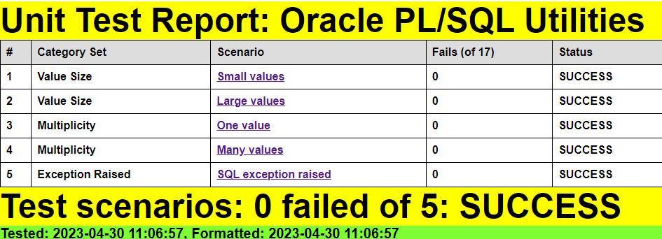

# Trapit

Oracle PL/SQL Unit Testing Module

:detective:

TRansactional API Testing (TRAPIT) framework for Oracle SQL and PL/SQL unit testing.

This is a lightweight framework for unit testing SQL and PL/SQL based on [The Math Function Unit Testing Design Pattern](https://brenpatf.github.io/2023/06/05/the-math-function-unit-testing-design-pattern.html).

There is a blog post on scenario selection in unit testing that may be of interest:

- [Unit Testing, Scenarios and Categories: The SCAN Method](https://brenpatf.github.io/jekyll/update/2021/10/17/unit-testing-scenarios-and-categories-the-scan-method.html)

# In this README...
[&darr; Background](#background)<br />
[&darr; Usage](#usage)<br />
[&darr; API](#api)<br />
[&darr; Installation](#installation)<br />
[&darr; Folder Structure](#folder-structure)<br />
[&darr; See Also](#see-also)<br />
## Background
[&uarr; In this README...](#in-this-readme)<br />

I explained the concepts for the unit testing design pattern in relation specifically to database testing in a presentation at the Oracle User Group Ireland Conference in March 2018:

- [The Database API Viewed As A Mathematical Function: Insights into Testing](https://www.slideshare.net/brendanfurey7/database-api-viewed-as-a-mathematical-function-insights-into-testing)

I later named the approach [The Math Function Unit Testing Design Pattern](https://brenpatf.github.io/2023/06/05/the-math-function-unit-testing-design-pattern.html) when I applied it in Javascript and wrote a JavaScript program to format results both in plain text and as HTML pages:
- [Trapit - JavaScript Unit Tester/Formatter](https://github.com/BrenPatF/trapit_nodejs_tester)

The module also allowed for the formatting of results obtained from testing in languages other than JavaScript by means of an intermediate output JSON file. In 2021 I developed a powershell module that included a utility to generate a template for the JSON input scenarios file required by the design pattern:
- [Powershell Trapit Unit Testing Utilities Module.](https://github.com/BrenPatF/powershell_utils/tree/master/TrapitUtils)

Also in 2021 I developed a systematic approach to the selection of unit test scenarios:
- [Unit Testing, Scenarios and Categories: The SCAN Method](https://brenpatf.github.io/jekyll/update/2021/10/17/unit-testing-scenarios-and-categories-the-scan-method.html)

In early 2023 I extended both the the JavaScript results formatter, and the powershell utility to incorporate Category Set as a scenario attribute. Both utilities support use of the design pattern in any language, while the unit testing driver utility is language-specific and is currently available in Powershell, JavaScript, Python and Oracle PL/SQL versions.

This module is a prerequisite for the unit testing parts of these other Oracle GitHub modules:
- [Utils - Oracle PL/SQL General Utilities Module](https://github.com/BrenPatF/oracle_plsql_utils)
- [Log_Set - Oracle PL/SQL Logging Module](https://github.com/BrenPatF/log_set_oracle)
- [Timer_Set - Oracle PL/SQL Code Timing Module](https://github.com/BrenPatF/timer_set_oracle)
- [Net_Pipe - Oracle PL/SQL Network Analysis Module](https://github.com/BrenPatF/plsql_network)

Examples of its use in testing four demo PL/SQL APIs can be seen here:
- [Oracle PL/SQL API Demos - demonstrating instrumentation and logging, code timing and unit testing of Oracle PL/SQL APIs](https://github.com/BrenPatF/oracle_plsql_api_demos)

## Usage
[&uarr; In this README...](#in-this-readme)<br />
[&darr; Usage - General](#usage---general)<br />
[&darr; Usage - Example](#usage---example)<br />

As noted above, the JavaScript module allows for unit testing of JavaScript programs and also the formatting of test results for both JavaScript and non-JavaScript programs. Similarly, the powershell module mentioned allows for unit testing of powershell programs, and also the generation of the JSON input scenarios file template for testing in any language.

In this section we'll start by describing the steps involved in [The Math Function Unit Testing Design Pattern](https://brenpatf.github.io/2023/06/05/the-math-function-unit-testing-design-pattern.html) at an overview level. This will show how the generic powershell and JavaScript utilities fit in alongside the language-specific driver utilities.

Then we'll show how to use the design pattern in unit testing Oracle programs by means of an example from another GitHub project.

### Usage - General
[&uarr; Usage](#usage)<br />
[&darr; Step 1: Create JSON File](#step-1-create-json-file)<br />
[&darr; Step 2: Create Results Object](#step-2-create-results-object)<br />
[&darr; Step 3: Format Results](#step-3-format-results)<br />

At a high level [The Math Function Unit Testing Design Pattern](https://brenpatf.github.io/2023/06/05/the-math-function-unit-testing-design-pattern.html) involves three main steps:

1. Create an input file containing all test scenarios with input data and expected output data for each scenario
2. Create a results object based on the input file, but with actual outputs merged in, based on calls to the unit under test
3. Use the results object to generate unit test results files formatted in HTML and/or text


The first and third of these steps are supported by generic utilities that can be used in unit testing in any language. The second step uses a language-specific unit test driver utility.

For non-JavaScript programs the results object is materialized using a library package in the relevant language. The diagram below shows how the processing from the input JSON file splits into two distinct steps:
- First, the output results object is created using the external library package which is then written to a JSON file
- Second, a script from the Trapit JavaScript library package is run, passing in the name of the output results JSON file

This creates a subfolder with name based on the unit test title within the file, and also outputs a summary of the results. The processing is split between three code units:
- Test Unit: External library function that drives the unit testing with a callback to a specific wrapper function
- Specific Test Package: This has a 1-line main program to call the library driver function, passing in the callback wrapper function
- Unit Under Test (API): Called by the wrapper function, which converts between its specific inputs and outputs and the generic version used by the library package


In the first step the external program creates the output results JSON file, while in the second step the file is read into an object by the Trapit library package, which then formats the results.

#### Step 1: Create JSON File
[&uarr; Usage - General](#usage---general)<br />

Step 1 requires analysis to determine the extended signature for the unit under test, and to determine appropriate scenarios to test.

The art of unit testing lies in choosing a set of scenarios that will produce a high degree of confidence in the functioning of the unit under test across the often very large range of possible inputs.

A useful approach to this can be to think in terms of categories of inputs, where we reduce large ranges to representative categories. I explore this approach further in this article:

- [Unit Testing, Scenarios and Categories: The SCAN Method](https://brenpatf.github.io/jekyll/update/2021/10/17/unit-testing-scenarios-and-categories-the-scan-method.html)

The results of this analysis can be summarised in three CSV files which a powershell program uses as inputs to create a template for the JSON file.

The powershell API, `Write-UT_Template` creates a template for the JSON file, with the full meta section, and a set of template scenarios having name as scenario key, a category set attribute, and a single record with default values for each input and output group. The API takes as inputs three CSV files:
  - `stem`_inp.csv: Input group triplets - (Input group name, field name, default value)
  - `stem`_out.csv: Input group triplets - (Output group name, field name, default value)
  - `stem`_sce.csv: Scenario triplets - (Category set, scenario name, active flag)


It may be useful during the analysis phase to create two diagrams, one for the extended signature:
- JSON Structure Diagram: showing the groups with their fields for input and output

and another for the category sets and categories:
- Category Structure Diagram: showing the category sets identified with their categories

You can see examples of these diagrams later in this document: [JSON Structure Diagram](#unit-test-wrapper-function) and [Category Structure Diagram](#scenario-category-analysis-scan).

The API can be run with the following powershell in the folder of the CSV files:

#### Format-JSON-Stem.ps1
```powershell
Import-Module ..\powershell_utils\TrapitUtils\TrapitUtils
Write-UT_Template 'stem' '|'
```
This creates the template JSON file, `stem`_temp.json based on the CSV files having prefix `stem` and using the field delimiter '|'. The template file is then updated manually with data appropriate to each scenario, and placed in the Oracle directory, INPUT_DIR, then loaded into the tt_units table by a call to the Trapit.Add_Ttu API.

The powershell API can be used for testing in any language.

#### Step 2: Create Results Object
[&uarr; Usage - General](#usage---general)<br />
[&darr; Trapit_Run Package](#trapit_run-package)<br />
[&darr; TT_Package.Purely_Wrap_Uut](#tt_packagepurely_wrap_uut)<br />

Step 2 requires the writing of a wrapper function that is called by a library packaged subprogram that runs all tests for a group name passed in as a parameter.

The library subprogram calls the wrapper function, specific to the unit under test, within a loop over the scenarios in the input JSON file. The names of the JSON file and of the wrapper function are assigned as part of the installation of the unit test data. The function specification is fixed, as shown in the extract below, while the function body is specific to the unit under test.

The library subprogram writes the output JSON file with the actual results, obtained from the wrapper function, merged in along with the expected results.

In non-database languages, such as JavaScript or Python, the wrapper function can be defined in a script and passed as a parameter in a call to the library subprogram. In Oracle PL/SQL the wrapper function is defined in the database and called using dynamic PL/SQL from the library subprogram.

##### Trapit_Run Package
[&uarr; Step 2: Create Results Object](#step-2-create-results-object)<br />

The test data are read from a table tt_units, with structure:

| Column                      | Type                  | Notes                                                                   |
|:----------------------------|:----------------------|:------------------------------------------------------------------------|
| unit_test_package_nm        | VARCHAR2(30) NOT NULL | Name of the package holding the wrapper function                        |
| purely_wrap_api_function_nm | VARCHAR2(30) NOT NULL | Name of the wrapper function                                            |
| group_nm                    | VARCHAR2(30)          | Unit test group name                                                    |
| description                 | VARCHAR2(500)         | Description of unit test                                                |
| title                       | VARCHAR2(100)         | Optional title of unit test, overrides JSON file attribute if set       |
| active_yn                   | VARCHAR2(1)           | Active flag, test not executed if set to N                              |
| input_json                  | CLOB                  | Input JSON text, read from database server file in an installation step |
| output_json                 | CLOB                  | Output JSON text, written on completion of a test run                   |


Unit tests are run by making a call to one of two library subprograms that run all tests for a group name passed in as a parameter.

```sql
PROCEDURE Run_Tests(p_group_nm VARCHAR2);
```
The above procedure runs the tests for the input group leaving the output JSON files in the assigned directory on the database server.

This version was originally used to execute step 3 separately from step 2.

```sql
FUNCTION Test_Output_Files(p_group_nm VARCHAR2) RETURN L1_chr_arr;
```
The above function runs the tests for the input group leaving the output JSON files in the assigned directory on the database server, and returns the full file paths in an array.

This version is used by a Powershell script that combines steps 2 and 3, as shown in step 3 below.

##### TT_Package.Purely_Wrap_Uut
[&uarr; Step 2: Create Results Object](#step-2-create-results-object)<br />

Here is the specification for the wrapper function (fixed apart from the function name), with the header comment text.
```sql
/***************************************************************************************************
Purely_Wrap_Uut: Unit test wrapper function for the unit under test

    Returns the 'actual' outputs, given the inputs for a scenario, with the signature expected for
    the Math Function Unit Testing design pattern, namely:

      Input parameter: 3-level list (type L3_chr_arr) with test inputs as group/record/field
      Return Value: 2-level list (type L2_chr_arr) with test outputs as group/record (with record as
                   delimited fields string)

***************************************************************************************************/
FUNCTION Purely_Wrap_Uut(
            p_inp_3lis                     L3_chr_arr) -- input list of lists (group, record, field)
            RETURN                         L2_chr_arr; -- output list of lists (group, record)

```
The input parameter and return value are of nested array types, and it is convenient for programming reasons to split the input records into fields, but return record values as delimited strings.


This wrapper function may need to write inputs to, and read outputs from, tables, but should be 'externally pure' in the sense that any changes made are rolled back before returning, including any made by the unit under test.

#### Step 3: Format Results
[&uarr; Usage - General](#usage---general)<br />

Step 3 involves formatting the results contained in the JSON output file from step 2, via the JavaScript formatter, and this step can be combined with step 2 for convenience.

- `Test-FormatDB` is the function from the TrapitUtils powershell package that calls the main test driver function, then passes the output JSON file name to the JavaScript formatter and outputs a summary of the results. It takes as parameters:

    - `unpw`        - Oracle user name / password string
    - `conn`        - Oracle connection string (such as the TNS alias)
    - `utGroup`     - Oracle unit test group
    - `testRoot`    - unit testing root folder, where results folders will be placed

##### Run-Test-Lib.ps1

```powershell
Import-Module ..\powershell_utils\TrapitUtils\TrapitUtils
Test-FormatDB 'lib/lib' 'orclpdb' 'lib' $PSScriptRoot
```
This script creates a results subfolder for each unit in the 'lib' group, with results in text and HTML formats, in the script folder, and outputs a summary of the following form (repeated for each unit in the group):

```
Results summary for file: [MY_PATH]/stem_out.json
==============================================

File:          stem_out.json
Title:         [Title]
Inp Groups:    [Inp Groups]
Out Groups:    [Out Groups]
Tests:         [Tests]
Fails:         [Fails]
Folder:        [Folder]
```
### Usage - Example
[&uarr; Usage](#usage)<br />
[&darr; Step 1: Create JSON File](#step-1-create-json-file-1)<br />
[&darr; Step 2: Create Results Object](#step-2-create-results-object-1)<br />
[&darr; Step 3: Format Results](#step-3-format-results-1)<br />

The example comes from [Utils - Oracle PL/SQL general utilities module](https://github.com/BrenPatF/oracle_plsql_utils), a module comprising a set of generic user-defined Oracle types and a PL/SQL package of functions and procedures of general utility.

In this section we show extracts from the README for that project for each of the three unit test steps.

#### Step 1: Create JSON File
[&uarr; Usage - Example](#usage---example)<br />
[&darr; Unit Test Wrapper Function](#unit-test-wrapper-function)<br />
[&darr; Scenario Category ANalysis (SCAN)](#scenario-category-analysis-scan)<br />

Step 1 requires analysis to determine the extended signature for the unit under test, and to determine appropriate scenarios to test.  The results of this analysis can be summarised in three CSV files which a powershell API, `Write-UT_Template`, uses as inputs to create a template for the JSON file.

This template file, tt_utils.purely_wrap_utils_temp.json, contains the full meta section (which describes groups and fields), and a set of template scenarios having name as scenario key, a category set attribute, and a single record with default values for each input and output group.

For each scenario element, we need to update the values to reflect the scenario to be tested, in the actual input JSON file, tt_utils.purely_wrap_utils_inp.json.

##### Unit Test Wrapper Function
[&uarr; Step 1: Create JSON File](#step-1-create-json-file-1)<br />

Here is a diagram of the input and output groups for this example:


From the input and output groups depicted we can construct CSV files with flattened group/field structures, and default values added, as follows (with `tt_utils.purely_wrap_utils_inp.csv` left, `tt_utils.purely_wrap_utils_out.csv` right):


These form two of the three input files for the Powershell script that generates a template ofr the input JSON file. The third is the scenarios file, shown in the next section.

##### Scenario Category ANalysis (SCAN)
[&uarr; Step 1: Create JSON File](#step-1-create-json-file-1)<br />

As explained in the article mentioned above, it can be very useful to think in terms of generic category sets that apply in many situations. In this case, where we are testing a set of independent utilities, they are particularly useful and can be applied across many of the utilities at the same time.

After analysis of the possible scenarios in terms of categories and category sets, we can depict them on a Category Structure diagram:


In this case, we can apply the generic category sets identified to the set of mostly independent utility programs. We can tabulate the results of the category analysis, and assign a scenario against each category set/category with a unique description:

|  # | Category Set     | Category | Scenario             |
|---:|:-----------------|:---------|:---------------------|
|  1 | Value Size       | Small    | Small values         |
|  2 | Value Size       | Large    | Large values         |
|  3 | Multiplicity     | One      | One value            |
|  4 | Multiplicity     | Many     | Many values          |
|  5 | Exception Raised | Yes      | SQL exception raised |

In this case we are not creating a specific scenario for the 'Exception Raised / No' category, since this is covered by all of the first four scenarios.

From the scenarios identified we can construct the following CSV file (`tt_utils.purely_wrap_utils_sce.csv`), taking the category set and scenario columns, and adding an initial value for the active flag:


#### Step 2: Create Results Object
[&uarr; Usage - Example](#usage---example)<br />
[&darr; TT_Utils.Purely_Wrap_Utils](#tt_utilspurely_wrap_utils)<br />

Step 2 requires the writing of a wrapper function that is called by a library packaged procedure that runs all tests for a group name passed in as a parameter.

##### TT_Utils.Purely_Wrap_Utils
[&uarr; Step 2: Create Results Object](#step-2-create-results-object-1)<br />

Here is an extract from the function body:
```sql
FUNCTION Purely_Wrap_Utils(
            p_inp_3lis                     L3_chr_arr)   -- input list of lists (group, record, field)
            RETURN                         L2_chr_arr IS -- output list of lists (group, record)

  c_delim                        VARCHAR2(1) := ';';
  l_act_2lis                     L2_chr_arr := L2_chr_arr();
  l_start_tmstp                  TIMESTAMP := SYSTIMESTAMP;
  l_start_cpu_cs                 PLS_INTEGER := DBMS_Utility.Get_CPU_Time;
  l_message                      VARCHAR2(4000);
BEGIN

  l_act_2lis.EXTEND(16);
  l_act_2lis(1) := heading(              p_value_2lis     => p_inp_3lis(1));
  l_act_2lis(2) := col_Headers(          p_value_2lis     => p_inp_3lis(2));
  l_act_2lis(3) := list_To_Line(         p_value_2lis     => p_inp_3lis(3));
  l_act_2lis(4) := join_Values(          p_value_2lis     => p_inp_3lis(4),
                                         p_delim          => p_inp_3lis(13)(1)(1));
''' [continues]
  RETURN l_act_2lis;

END Purely_Wrap_Utils;

```

#### Step 3: Format Results
[&uarr; Usage - Example](#usage---example)<br />
[&darr; Unit Test Report - Oracle PL/SQL Utilities](#unit-test-report---oracle-plsql-utilities)<br />
[&darr; Scenario 1: Small values [Category Set: Value Size]](#scenario-1-small-values-category-set-value-size)<br />

Step 3 involves formatting the results contained in the JSON output file from step 2, via the JavaScript formatter, and this step can be combined with step 2 for convenience.

The unit test script creates a results subfolder for each unit in the 'lib' group, with results in text and HTML formats, in the script folder, and outputs the following summary:

```

File:          tt_utils.purely_wrap_utils_out.json
Title:         Oracle PL/SQL Utilities
Inp Groups:    16
Out Groups:    17
Tests:         5
Fails:         0
Folder:        oracle-pl_sql-utilities
```

Next we show the scenario-level summary of results.

##### Unit Test Report - Oracle PL/SQL Utilities
[&uarr; Step 3: Format Results](#step-3-format-results-1)<br />

Here is the results summary in HTML format:


##### Scenario 1: Small values [Category Set: Value Size]
[&uarr; Step 3: Format Results](#step-3-format-results-1)<br />

The textbox shows extracts of the results for the first scenario, with groups 1 and 16 shown for both input and output sections, and with output group 17, 'Unhandled Exception' being dynamically created by the library package to capture any unhandled exceptions.

```
SCENARIO 1: Small values [Category Set: Value Size] {
=====================================================
   INPUTS
   ======
      GROUP 1: Heading {
      ==================
            #  Text  #Blanks Pre  #Blanks Post
            -  ----  -----------  ------------
            1  h     0            0
      }
      =
      ...
      GROUP 16: XPlan Cursor {
      ========================
            #  Cursor Text                                                    Marker        Outline Y/N
            -  -------------------------------------------------------------  ------------  -----------
            1  SELECT /*+ gather_plan_statistics XPLAN_MARKER */ 1 FROM DUAL  XPLAN_MARKER
      }
      =
   OUTPUTS
   =======
      GROUP 1: Heading {
      ==================
            #  Line
            -  ----
            1  h
            2  =
      } 0 failed of 2: SUCCESS
      ========================
      ...
      GROUP 16: XPlan List (keyword extract) {
      ========================================
            #  XPlan Line
            -  ----------------------------------------------------------------------
            1  LIKE /SQL_ID.+, child number.+/: SQL_ID  62unzfghvzfw4, child number 0
            2  SELECT /*+ gather_plan_statistics XPLAN_MARKER */ 1 FROM DUAL
            3  LIKE /Plan hash value: .+/: Plan hash value: 1388734953
      } 0 failed of 3: SUCCESS
      ========================
      GROUP 17: Unhandled Exception: Empty as expected: SUCCESS
      =========================================================
} 0 failed of 17: SUCCESS
=========================
```
## API
[&uarr; In this README...](#in-this-readme)<br />
[&darr; Trapit](#trapit-1)<br />
[&darr; Trapit_Run](#trapit_run)<br />
[&darr; TrapitUtils.psm1 [powershell module]](#trapitutilspsm1-powershell-module)<br />

### Trapit
[&uarr; API](#api)<br />

This section excludes public program units that are only used by the package Trapit_Run.

#### Add_Ttu

```sql
    Trapit.Add_Ttu(p_unit_test_package_nm, p_purely_wrap_api_function_nm, p_group_nm, p_active_yn, p_input_file);
```

Adds a record to tt_units table, with parameters as follows:

- `p_unit_test_package_nm`: unit test package name
- `p_purely_wrap_api_function_nm`: wrapper function name
- `p_group_nm`: test group name
- `p_active_yn`: active Y/N flag
- `p_input_file`: name of input file, which has to exist in Oracle directory `input_dir`

### Trapit_Run
[&uarr; API](#api)<br />

This package runs with Invoker rights, not the default Definer rights, so that dynamic SQL calls to the test packages in the calling schema do not require execute privilege to be granted to owning schema (if different from caller).

#### Run_Tests
```sql
    Trapit_Run.Run_Tests(p_group_nm);
```

Runs the unit test program for each package procedure set to active in tt_units table for a given test group, with parameters as follows:

- `p_group_nm`: test group name

Normally the test packages in a group will be within a single schema from where the tests would be run. This version was originally used to execute unit test step 3 separately from step 2.

#### Test_Output_Files
```sql
    l_file_lis L1_chr_arr := Trapit_Run.Test_Output_Files(p_group_nm);
```
Runs the unit test program for each record set to active in tt_units table for a given test group, with parameters as follows:

- `p_group_nm`: test group name

Returns a list of the full paths for the output JSON files. This version is used by the Powershell script, Test-FormatDB, that combines unit test steps 2 and 3.

### TrapitUtils.psm1 [powershell module]
[&uarr; API](#api)<br />

This powershell module contains two main entry point functions:

- A function to write a template for the unit test scenarios JSON file
- A function to automate the running of the Oracle testing package and the formatting of the resulting JSON output files by a JavaScript program

#### Write-UT_Template
```powershell
    Write-UT_Template($stem, $delimiter)
```
Writes a template for the unit test scenarios JSON file, with parameters as follows:

- `$stem`: filename stem
- `$delimiter`: delimiter

#### Test-FormatDB
```powershell
    Test-FormatDB($unpw, $conn, $utGroup, $testRoot)
```
Runs the unit test program for each package procedure set to active in tt_units table for a given test group, with parameters as follows:

- `$unpw`: username/password
- `$conn`: connection string, e.g. TNS alias
- `$utGroup`: test group name
- `$testRoot`: folder to place the output JSON file and results subfolders

Returns results summaries for each unit tested.

The function copies the JSON files to the specified folder and runs the JavaScript program to create the results folders there.
## Installation
[&uarr; In this README...](#in-this-readme)<br />
[&darr; Prerequisite Applications](#prerequisite-applications)<br />
[&darr; Oracle Installs](#oracle-installs)<br />
[&darr; Powershell and JavaScript Packages](#powershell-and-javascript-packages)<br />

### Prerequisite Applications
[&uarr; Installation](#installation)<br />
[&darr; Oracle Client](#oracle-client)<br />
[&darr; Node.js](#nodejs)<br />
[&darr; Powershell](#powershell)<br />

#### Oracle Client
[&uarr; Prerequisite Applications](#prerequisite-applications)<br />

An Oracle client is required, including SQL*Plus, with access to an Oracle database:

- [Oracle Instant Client Downloads for Microsoft Windows (x64) 64-bit](https://www.oracle.com/ie/database/technologies/instant-client/winx64-64-downloads.html)

#### Node.js
[&uarr; Prerequisite Applications](#prerequisite-applications)<br />

The unit test results are formatted using a JavaScript program, which is included as part of the current project. Running the program requires the Node.js application:

- [Node.js Downloads](https://nodejs.org/en/download)

#### Powershell
[&uarr; Prerequisite Applications](#prerequisite-applications)<br />

Powershell is optional, and is used in the project for automation purposes, and for generating a template for the JSON input file required by the Math Function Unit Testing design pattern:

- [Installing Windows PowerShell](https://learn.microsoft.com/en-us/powershell/scripting/windows-powershell/install/installing-windows-powershell)

### Oracle Installs
[&uarr; Installation](#installation)<br />
[&darr; Install 1: Install prerequisite module](#install-1-install-prerequisite-module)<br />
[&darr; Install 2: Install Oracle Trapit module](#install-2-install-oracle-trapit-module)<br />
[&darr; Install 3: Create synonyms to lib](#install-3-create-synonyms-to-lib)<br />

#### Install 1: Install prerequisite module
[&uarr; Oracle Installs](#oracle-installs)<br />

The install depends on the prerequisite module Utils, and `lib` schema refers to the schema in which Utils is installed.

The prerequisite module can be installed by following the instructions at [Utils on GitHub](https://github.com/BrenPatF/oracle_plsql_utils). This allows inclusion of the examples and unit tests for the module. Alternatively, the next section shows how to install the module directly without its examples or unit tests here.

#### [Schema: sys; Folder: install_prereq] Create lib and app schemas and Oracle directory
- install_sys.sql creates an Oracle directory, `input_dir`, pointing to 'c:\input'. Update this if necessary to a folder on the database server with read/write access for the Oracle OS user
- Run script from slqplus:

```sql
SQL> @install_sys
```

#### [Schema: lib; Folder: install_prereq\lib] Create lib components
- Run script from slqplus:

```sql
SQL> @install_lib_all
```
#### [Schema: app; Folder: install_prereq\app] Create app synonyms
- Run script from slqplus:

```sql
SQL> @c_syns_all
```

#### Install 2: Install Oracle Trapit module
[&uarr; Oracle Installs](#oracle-installs)<br />

#### [Schema: lib; Folder: lib]
- Run script from slqplus:

```sql
SQL> @install_trapit app
```
This creates the required components for the base install along with grants for them to the app schema (passing none instead of app will bypass the grants). It requires a minimum Oracle database version of 12.2. To grant privileges to another `schema`, run the grants script directly, passing `schema`:

```sql
SQL> @grant_trapit_to_app schema
```

#### Install 3: Create synonyms to lib
[&uarr; Oracle Installs](#oracle-installs)<br />

#### [Schema: app; Folder: app]
- Run script from slqplus:

```sql
SQL> @c_trapit_syns lib
```
This install creates private synonyms to the lib schema. To create synonyms within another schema, run the synonyms script directly from that schema, passing lib schema.

### Powershell and JavaScript Packages
[&uarr; Installation](#installation)<br />
[&darr; Format-JSON-Utils.ps1](#format-json-utilsps1)<br />
[&darr; Test-Format-Utils.ps1](#test-format-utilsps1)<br />

As noted in the Prerequisite Applications section, JavaScript is used to format unit test results, and Powershell is optionally used for automation purposes, and for generating a template for the JSON input file required by the Math Function Unit Testing design pattern.

Both JavaScript and Powershell packages have their own GitHub projects:

- [Trapit - JavaScript Unit Tester/Formatter](https://github.com/BrenPatF/trapit_nodejs_tester)
- [Powershell utilities module](https://github.com/BrenPatF/powershell_utils)

However, for convenience the packages are included in the current project folder structure, rooted in the powershell_utils subfolder, and do not require separate installation.

There are two main entry points, whose usage can be seen in the project:

- [Utils - Oracle PL/SQL general utilities module](https://github.com/BrenPatF/oracle_plsql_utils)

#### Format-JSON-Utils.ps1
[&uarr; Powershell and JavaScript Packages](#powershell-and-javascript-packages)<br />

This is used to generate a template input JSON file for the Oracle PL/SQL general utilities module.
```sql
Import-Module ..\powershell_utils\TrapitUtils\TrapitUtils
Write-UT_Template 'tt_utils.purely_wrap_utils' ';'
```

#### Test-Format-Utils.ps1
[&uarr; Powershell and JavaScript Packages](#powershell-and-javascript-packages)<br />

This run Oracle unit tests for a given test group ('lib' here) for the Oracle PL/SQL general utilities module, and includes the formatting step by means of a call to the JavaScript formatter.
```sql
Import-Module ..\powershell_utils\TrapitUtils\TrapitUtils
Test-FormatDB 'lib/lib' 'orclpdb' 'lib' $PSScriptRoot
```
## Folder Structure
[&uarr; In this README...](#in-this-readme)<br />

The project folder structure is shown below.


There are five subfolders below the trapit root folder:
- `app`: Application schema folder (main)
- `install_prereq`: Installation prerequisites
- `lib`: Library schema folder (main)
- `png`: Image files for the README
- `powershell_utils`: Powershell packages, with JavaScript Trapit module included in TrapitUtils

## See Also
[&uarr; In this README...](#in-this-readme)<br />
- [Oracle Instant Client Downloads for Microsoft Windows (x64) 64-bit](https://www.oracle.com/ie/database/technologies/instant-client/winx64-64-downloads.html)
- [Node.js Downloads](https://nodejs.org/en/download)
- [Installing Windows PowerShell](https://learn.microsoft.com/en-us/powershell/scripting/windows-powershell/install/installing-windows-powershell)
- [The Math Function Unit Testing Design Pattern](https://brenpatf.github.io/2023/06/05/the-math-function-unit-testing-design-pattern.html)
- [Trapit - JavaScript Unit Tester/Formatter](https://github.com/BrenPatF/trapit_nodejs_tester)
- [Unit Testing, Scenarios and Categories: The SCAN Method](https://brenpatf.github.io/jekyll/update/2021/10/17/unit-testing-scenarios-and-categories-the-scan-method.html)
- [Powershell Utilities Module](https://github.com/BrenPatF/powershell_utils)
- [Utils - Oracle PL/SQL General Utilities Module](https://github.com/BrenPatF/oracle_plsql_utils)
- [Log_Set - Oracle PL/SQL Logging Module](https://github.com/BrenPatF/log_set_oracle)
- [Timer_Set - Oracle PL/SQL Code Timing Module](https://github.com/BrenPatF/timer_set_oracle)
- [Net_Pipe - Oracle PL/SQL Network Analysis Module](https://github.com/BrenPatF/plsql_network)
- [Oracle PL/SQL API Demos - demonstrating instrumentation and logging, code timing and unit testing of Oracle PL/SQL APIs](https://github.com/BrenPatF/oracle_plsql_api_demos)
- [Trapit - Oracle PL/SQL Unit Testing Module](https://github.com/BrenPatF/trapit_oracle_tester)

## Software Versions

- Windows 11
- Powershell 5/7
- npm 6.13.4
- Node.js v12.16.1
- Oracle Database Version 21.3.0.0.0

## License
MIT
